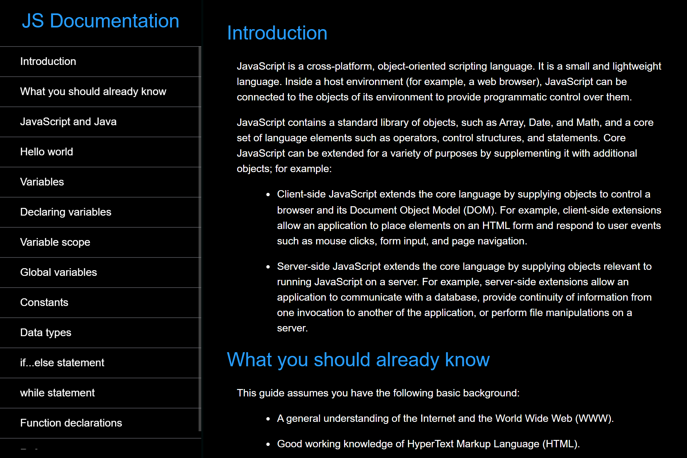
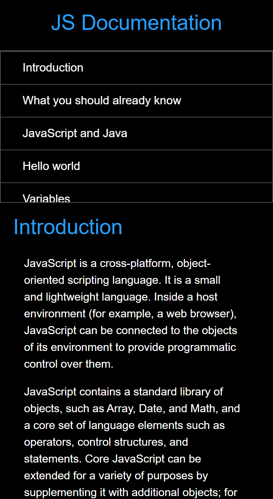

# Technical Documentation Project

## Table of Contents

- [Overview](#overview)
- [Screenshots](#screenshots)
- [Links](#links)
- [My Process](#my-process)
- [Built With](#built-with)
- [Continued Development](#continued-development)
- [Useful Resources](#useful-resources)
- [Author](#author)

---

## Overview

This project is a technical documentation page, showcasing a clean and responsive layout for easy readability and navigation. The page includes:

- A **responsive design** implemented using media queries to ensure a seamless experience across desktop, tablet, and mobile devices.
- A fixed **navigation bar** on the left side (or at the top for smaller screens) for easy access to different sections of the documentation.
- **Disclaimer**: The content in the documentation was not written by me. It was sourced from an example provided by FreeCodeCamp. [Source Link Here](https://technical-documentation-page.freecodecamp.rocks/).

---

## Screenshots

### Desktop View

### Mobile View

---

## Links

- **Repository**: [GitHub Repository](https://github.com/dquinn089/fcc-technical-documentation)
- **Live Demo**: [Live Link](https://dquinn089.github.io/fcc-technical-documentation/)

---

## My Process

1. **HTML Structure**: Built the main structure of the documentation, including a navigation bar and sections for the content.
2. **CSS Styling**: Styled the page using CSS custom properties, focusing on maintaining a clean and professional look.
3. **Responsive Design**: Used media queries to adjust the layout for smaller screens, ensuring that the navigation bar transitions from a fixed side panel to a top bar on mobile devices.
4. **Content Integration**: Added the documentation content sourced from FreeCodeCamp, ensuring it was properly formatted and readable.

---

## Built With

- **Semantic HTML5**: To create a well-structured and accessible layout.
- **CSS Custom Properties**: To style the page and define reusable design tokens.
- **Media Queries**: For implementing responsive design across different devices.

---

## Continued Development

I plan to:

- Add animations to the navigation bar to improve user experience.
- Create additional technical documentation pages on topics that I’ve personally written or researched.
- Experiment with interactive elements such as collapsible sections or a dark mode toggle.

---

## Useful Resources

- **[FreeCodeCamp](https://www.freecodecamp.org/)**: Example content for the documentation.
- **[MDN Web Docs](https://developer.mozilla.org/)**: For references on responsive design and media queries.
- **[W3Schools](https://www.w3schools.com/)**: For quick tips on HTML and CSS.

---

## Author

- **GitHub**: [dquinn089](#)
- **Frontend Mentor**: [dquinn089](#)
